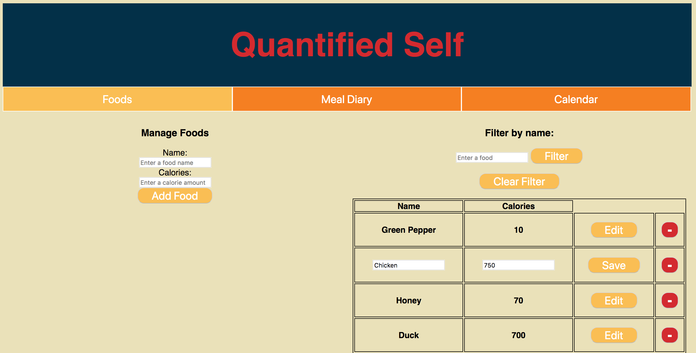

# Quantified Self Front End

## Introduction
This is a simple calorie counter app that allows users to add and edit foods in our database.  Users can also set caloric goals for meals and calculate totals after adding food to meals. Users will also have the option to save meals to their calendar so they can see which days they hit their goals.

## Initial Setup

These instructions will get you a copy of the project up and running on your local machine for development and testing purposes.

From GitHub clone down repository using the following commands in terminal:
* `git clone git@github.com:Diazblack/quantified-self-fe.git`
* `cd quantified-self-fe`

## How to Use

### Running the Server Locally

To run the server locally run:
* `npm start`

In your browser visit:
* `http://localhost:8080/` to run your application.

### Home Page

When a user first visits the page they see an index of foods already in the system. There is also a form to input information to add a new food.

#### Filtering Foods
A user can also enter a food name in the filter field and filter the results to show only food containing that searched term.  Clicking "Clear Filter" will remove the filter and show all food results.

#### Editing Foods
A user can also click on the Edit button next to a food to change the food name and calories. Once the edit button is clicked, the user will have the option to save their changes.

## Known Issues

## Core Contributors
* Cesar Jolibois - Github: [Diazblack](https://github.com/Diazblack)
* Jennifer Lao - Github: [jplao](https://www.github.com/jplao)

## Built With

* [JavaScript](https://www.javascript.com/)
* [jQuery](https://jquery.com/)
* [Express](https://expressjs.com/)
* [Mocha](https://mochajs.org/)
* [Chai](https://chaijs.com/)

## GitHub Pages Setup

To view this project in production visit <https://diazblack.github.io/quantified-self-fe/>.
