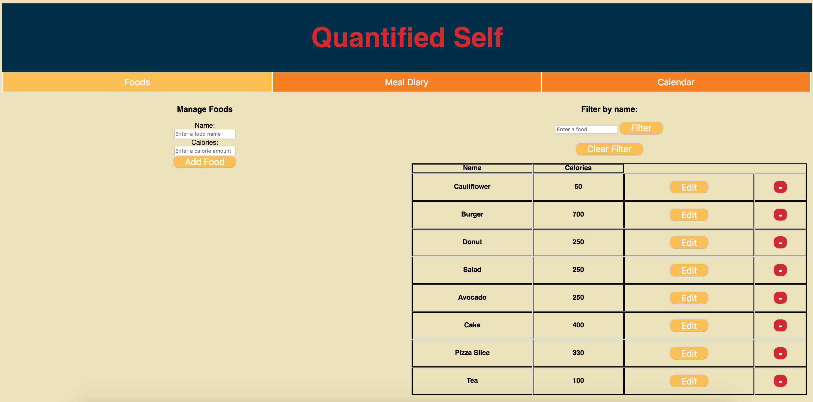
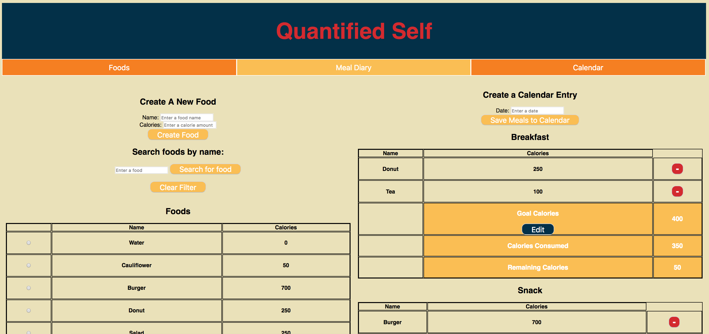
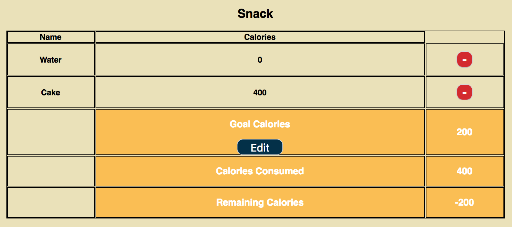

# Quantified Self Front End

## Introduction
This is a simple calorie counter app that allows users to add and edit foods in our database.  Users can also set caloric goals for meals and calculate totals after adding food to meals. Users will also have the option to save meals to their calendar so they can see which days they hit their goals.

## Initial Setup

These instructions will get you a copy of the project up and running on your local machine for development and testing purposes.

From GitHub clone down repository using the following commands in terminal:
* `git clone git@github.com:Diazblack/quantified-self-fe.git`
* `cd quantified-self-fe`

## How to Use

### Running the Server Locally

To run the server locally run:
* `npm start`

In your browser visit:
* `http://localhost:8080/` to run your application.

### Home Page

When a user first visits the page they see an index of foods already in the system. There is also a form to input information to add a new food.

### Food Functionality
#### Filtering Foods
A user can also enter a food name in the filter field and filter the results to show only food containing that searched term.  Clicking "Clear Filter" will remove the filter and show all food results.

#### Editing Foods
A user can also click on the Edit button next to a food to change the food name and calories. Once the edit button is clicked, the user will have the option to save their changes.

#### Creating Foods
A user can fill in the name and calories of a new food and click on "Add Food" to create a new food.  Once created, that new food will be added to the food list.

#### Deleting Foods
A user can also click on the red button next to an individual food to delete it from the database.

### Meal Diary
A user can visit the meal diary page by clicking on Meal Diary.  Once on the diary page, A user will see a list of available foods and meals.

#### Adding Food to Meals
A user can use the radio buttons to select a food and then click on a button to add it to "breakfast", "snack", "lunch", or "dinner".

Clicking on a meal button will add the selected food to that meal and a confirmation message will appear.

#### Deleting Food from Meals
A user can also delete a food from a meal by clicking on the red minus button next to a meal.

 

#### Totals
A user can see 3 calculated caloric totals at the bottom of the page.  "Goal Calories" is the calculated sum of the caloric goals for all meals.  "Consumed Calories" calculates the total calories of all foods added to meals.  "Remaining Calories" subtracts the total calories consumed from the goal calories to let a user know if they've reached their goal or not.

#### Setting Goals
Each meal has a preset Calorie goal.  A user can change the caloric goal for an individual meal by clicking on "Edit".  An input field will appear and a user can enter a new caloric goal and click on "Save".  Changing the caloric goal will also change the calculated totals

#### Creating Calendar Entries
Once meals and goals are set, a user can enter a date and click on "Save to Calendar".  This adds a new date to the calendar database with the meal and caloric info set by the user.

### Calendar
By visiting the Calendar page, a user can see their saved data.  The table shows the caloric info as well as the foods for each meal for each date that was saved.

## Known Issues
* Validations have not been created to stop duplicate entries for foods nor calendar entry dates.

* When editing a food with more than one word in its name, the name placeholder value when clicking on edit is only the first word of the food's name.

## Core Contributors
* Cesar Jolibois - Github: [Diazblack](https://github.com/Diazblack)
* Jennifer Lao - Github: [jplao](https://www.github.com/jplao)

## Built With

* [JavaScript](https://www.javascript.com/)
* [jQuery](https://jquery.com/)
* [Express](https://expressjs.com/)
* [Mocha](https://mochajs.org/)
* [Chai](https://chaijs.com/)

## GitHub Pages Setup

To view this project in production visit <https://diazblack.github.io/quantified-self-fe/>.
